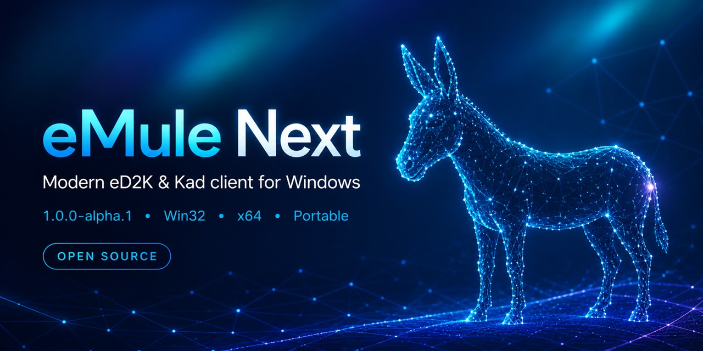
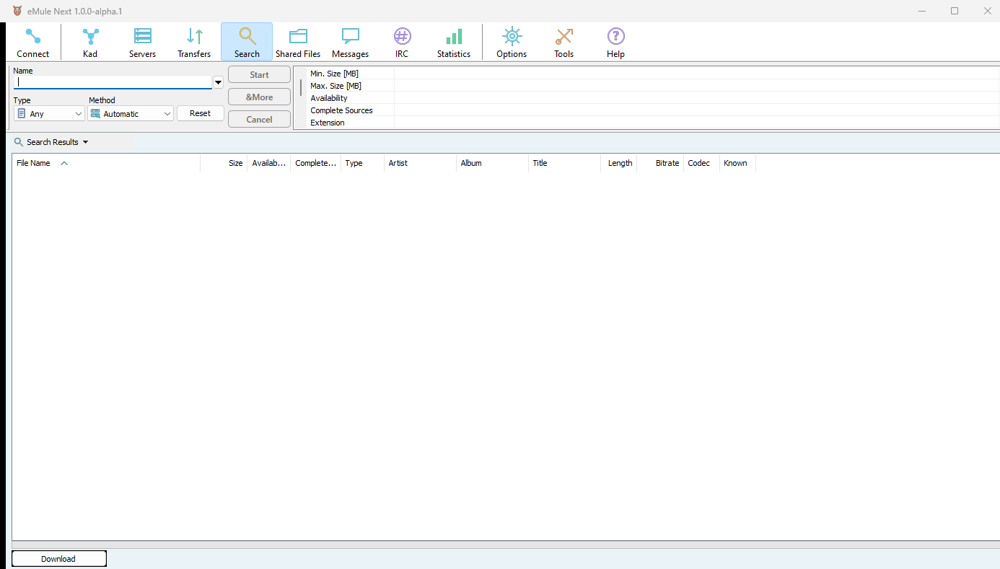
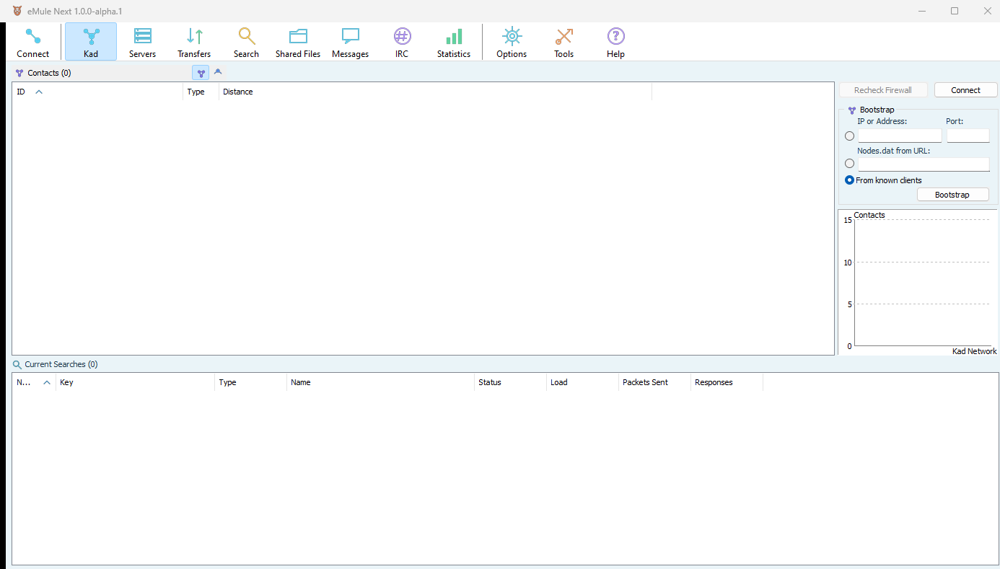
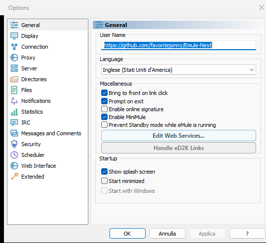

  

# eMule Next

**eMule Next is an independent, open-source eMule Community fork for Windows, with a modernised interface, Win32 and x64 portable builds, 43 languages, and continued compatibility with the eD2K and Kad networks.**

## Download

### [Download eMule Next 1.0.0-alpha.1](https://github.com/favoritejonny/Emule-Next/releases/tag/v1.0.0-alpha.1)

| Windows package | Recommended for | Direct download |
| --- | --- | --- |
| x64 portable | Most modern 64-bit Windows PCs | [Download x64 ZIP](https://github.com/favoritejonny/Emule-Next/releases/download/v1.0.0-alpha.1/eMuleNext-1.0.0-alpha.1-x64-portable.zip) |
| Win32 portable | 32-bit Windows and older compatible systems | [Download Win32 ZIP](https://github.com/favoritejonny/Emule-Next/releases/download/v1.0.0-alpha.1/eMuleNext-1.0.0-alpha.1-win32-portable.zip) |
| SHA-256 checksums | Verify either downloaded archive | [Download checksums](https://github.com/favoritejonny/Emule-Next/releases/download/v1.0.0-alpha.1/SHA256SUMS-1.0.0-alpha.1.txt) |

This is an **alpha pre-release** for testing. The portable builds do not require installation: extract the ZIP into a writable folder and run `eMuleNext.exe`.

The current executables are not digitally signed, so Microsoft Defender SmartScreen may display a warning on first launch. Verify that the ZIP came from this repository and compare its SHA-256 checksum before continuing. See [WINDOWS-SMARTSCREEN.md](WINDOWS-SMARTSCREEN.md) for the safe procedure.

## Highlights

- Native Windows Win32 and x64 builds.
- Portable packages that keep their configuration inside their own folder.
- 43 included interface languages.
- Modern Light as the default theme, with refreshed icons and interface details.
- eD2K server and Kad network compatibility.
- Updated first-run experience, help links and GitHub issue reporting.
- No project telemetry, analytics or automatic crash-report upload.

## Screenshots

<table>
  <tr>
    <td width="50%"></td>
    <td width="50%"></td>
  </tr>
  <tr>
    <td align="center"><strong>Search</strong></td>
    <td align="center"><strong>Kad network</strong></td>
  </tr>
</table>

  
   
  <strong>Modernised preferences and included language selection</strong>

## Project status

Both portable packages in `1.0.0-alpha.1` passed the current clean-start and manual stability tests. This remains an early public build: back up important configuration, report reproducible problems through [GitHub Issues](https://github.com/favoritejonny/Emule-Next/issues), and do not treat it as a finished stable release.

The project is maintained by Jonny Favorite. It is not an official eMule Project release and is not affiliated with, endorsed by, or sponsored by the original eMule Project.

## Safe and lawful use

eMule Next is a general-purpose peer-to-peer client. Users are responsible for downloading and sharing only material they are authorised to receive or distribute. Do not use project channels to publish copyrighted content, infringing links, server lists of uncertain provenance, personal configuration files or credentials.

## Privacy

The current distribution does not collect crash reports, analytics or other telemetry for the project maintainer. Peer-to-peer network traffic is inherently exchanged with other participating peers and servers as required by the protocol. See [PRIVACY.md](PRIVACY.md).

## Build from source

The Visual Studio solution is [srchybrid/emule.sln](srchybrid/emule.sln). Release executables are built separately for Win32 and x64. The portable package script is [packaging/Build-PortablePackages.ps1](packaging/Build-PortablePackages.ps1).

GitHub Actions rebuilds and checks both architectures on pushes and pull requests. The final executables are inspected for the required Windows security protections, then tested in a clean portable profile. Verified packages include a file manifest, an SPDX 2.3 SBOM and SHA-256 checksums. See [docs/SECURITY-AND-CI.md](docs/SECURITY-AND-CI.md).

The focused post-alpha plan is limited to a cache for large shared collections and optional VPN-interface protection. IPv6 is reserved for a later compatibility release and QUIC remains experimental. See [docs/TECHNICAL_ROADMAP.md](docs/TECHNICAL_ROADMAP.md).

Binary releases must be accompanied by the complete corresponding source code and all notices required by the included third-party components. Maintainers should complete [RELEASE_CHECKLIST.md](RELEASE_CHECKLIST.md) before publishing a new version.

## License and notices

eMule Next is a derivative work of eMule and is distributed under the GNU General Public License, version 2 or, at the recipient's option, any later version. See [LICENSE](LICENSE).

- [NOTICE.md](NOTICE.md) — upstream attribution and name clarification.
- [THIRD_PARTY_NOTICES.md](THIRD_PARTY_NOTICES.md) — included libraries and notices.
- [CHANGES.md](CHANGES.md) — eMule Next changes.
- [SOURCE-CODE.md](SOURCE-CODE.md) — corresponding-source information.
- [LEGAL_STATUS.md](LEGAL_STATUS.md) — release-clearance record.

## Participate

- Read [SUPPORT.md](SUPPORT.md) before asking for help.
- Use the guided [GitHub issue forms](https://github.com/favoritejonny/Emule-Next/issues/new/choose) for reproducible bugs and feature ideas.
- Read [CONTRIBUTING.md](CONTRIBUTING.md) before proposing a source change.
- Report security vulnerabilities privately as described in [SECURITY.md](SECURITY.md), never in a public issue.
- Follow [CODE_OF_CONDUCT.md](CODE_OF_CONDUCT.md) in all project spaces.
